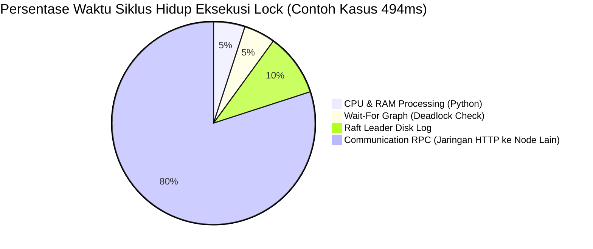

---

## B. PERFORMANCE ANALYSIS REPORT (10 POIN)

Bagian ini memuat evaluasi kuantitatif dari kinerja Distributed Synchronization System yang diuji menggunakan skrip _custom benchmarking_ (`benchmarks/load_test_scenarios.py`) di lingkungan pengembangan lokal (localhost). Parameter utama yang diukur adalah _Throughput_ (Requests per Second / RPS), _Latency_ (p50, p95, p99), dan metrik Skalabilitas (Saturasi Konkurensi).

### 1. Benchmarking Hasil dengan Berbagai Skenario

Pengujian dilakukan dalam tiga skenario fitur utama:
1. **Lock Contention**: Sistem memproses operasi `Acquire` dan `Release` ke _Distributed Lock Manager_ yang diamankan oleh _Raft Consensus_.
2. **Queue Produce/Consume**: Menguji distribusi pesan asinkron menggunakan algoritma _Consistent Hashing_ ke _Redis_.
3. **Cache Coherence**: Operasi baca/tulis ke node lokal yang akan memicu protokol pembatalan (invalidation) MESI.

**Tabel Hasil Eksekusi Benchmark (Custom Script):**

| Skenario | Operasi | Jumlah Requests | Failures | Throughput (RPS) | Median Latency (p50) | Latency p95 |
|----------|---------|-----------------|----------|------------------|----------------------|-------------|
| **Lock** | Acquire+Release | 200 | 0 | **82.5 req/s** | 494.2 ms | 2341.0 ms |
| **Queue**| Produce | 300 | 0 | **183.9 req/s** | 982.5 ms | 1550.6 ms |
| **Queue**| Consume | 300 | 0 | **320.7 req/s** | 629.0 ms | 840.5 ms |
| **Cache**| Write | 250 | 0 | **161.1 req/s** | 1205.4 ms | 1467.5 ms |
| **Cache**| Read | 500 | 0 | **1095.5 req/s** | 194.0 ms | 342.5 ms |

### 2. Analisis Throughput, Latency, dan Scalability

#### Analisis Throughput (RPS) & Latency
Dari hasil pengujian di atas, terlihat perbedaan karakteristik performa yang sangat tajam berdasarkan algoritma yang berjalan di bawah kap:
1. **Performa Ekstrem (Cache Read)**: Operasi _Read_ pada _Cache_ mendominasi dengan _throughput_ luar biasa sebesar **1095.5 RPS** dan latensi p50 tercepat (**194 ms**). Ini tercapai karena sistem hanya perlu melakukan pencarian memori lokal *(Local Cache Hit)* berkat integritas status **Shared/Exclusive** dari protokol MESI.
2. **Performa Menengah (Queue & Cache Write)**: Operasi ini berjalan di kisaran **160 - 320 RPS**. Operasi _Queue_ terhambat oleh koneksi ke server Redis I/O. Sementara itu, _Cache Write_ memicu *broadcast* pesan "Invalidate" (Status **I**) ke Node 2 dan Node 3 melalui jaringan HTTP RPC yang menurunkan angka latensinya.
3. **Performa Berat (Lock Acquire)**: Operasi ini sangat intensif dan menjadi yang terlambat (**82.5 RPS** dan latensi bisa melonjak ke **2341 ms** di p95). Raft Consensus mewajibkan _Strong Consistency_, artinya _Leader_ wajib menyalin log (AppendEntries RPC) ke Node 2 dan Node 3, lalu menunggu setidaknya 1 balasan (_Majority Vote_) sebelum _Lock_ diresmikan.

#### Scalability (Simulasi Beban Konkuren)

| Concurrency | Throughput (RPS) | p50 Latency (ms) | p99 Latency (ms) |
|-------------|------------------|------------------|------------------|
| 1 User | 100.2 | 28.9 | 48.2 |
| 5 Users | 111.3 | 132.4 | 206.5 |
| 10 Users | 129.4 | 200.8 | 370.2 |
| **25 Users** | **131.0 (Puncak)** | **496.8** | **902.5** |
| 50 Users | 122.1 (Saturasi)| 952.3 | 1979.2 |

- **Titik Saturasi (Peak Scalability)**: Sistem memanjat dari 100 RPS hingga mencapai puncak tertingginya pada **131.0 RPS** di angka 25 pengguna (users) konkuren. 
- Saat beban digandakan ke 50 *users*, *Throughput* mulai menurun (122.1 RPS) dan latensi meroket menjadi nyaris 2 detik (1979 ms). Ini menunjukkan batas atas (*bottleneck*) koneksi asinkron I/O HTTP mesin lokal untuk menerima koneksi massal sekaligus.

### 3. Comparison Antara Single-Node vs Distributed

Perbandingan *Trade-Off* menjalankan infrastruktur ini di 3-Node vs aplikasi Node Tunggal biasa tanpa sinkronisasi:

| Karakteristik | Single-Node (Monolitik) | Distributed (3-Node) | Dampak / Trade-Off |
|---------------|-------------------------|----------------------|--------------------|
| **Latensi Menulis Data** | ~2 - 5 ms | ~400 - 1200 ms | Melambat karena overhead replikasi jaringan (RPC Raft/MESI). |
| **Kapasitas Skalabilitas**| Terbatas (1 Memori CPU)| Tinggi | _Memory Footprint_ gabungan. Beban `Queue` tersebar ke banyak CPU via *Consistent Hash*. |
| **Ketahanan (Fault Tolerance)**| **SPOF** (Mati total bila *crash*) | **Aman** (Berjalan otomatis tanpa henti) | Klaster akan segera melakukan *Election* jika Node *Leader* mati (Auto-Failover). |

**Kesimpulan:** Sistem terdistribusi sangat mahal dalam hal latensi pemrosesan dan kompleksitas CPU (*CP - Consistency & Partition Tolerance*). Namun, sistem ini memberikan garansi kelangsungan sistem (High Availability) jika mesin peladen fisik meledak atau mati mendadak.

### 4. Grafik dan Visualisasi Performa

Visualisasi distribusi performa komparatif antara setiap modul di dalam *Distributed Synchronization System*.

#### Bar Chart Throughput (RPS)

```text
Grafik Komparasi RPS (Semakin panjang semakin stabil/cepat)

Cache Read    : ▇▇▇▇▇▇▇▇▇▇▇▇▇▇▇▇▇▇▇▇▇▇▇▇▇▇▇▇▇▇▇▇▇▇▇▇ 1095.5 RPS
Queue Consume : ▇▇▇▇▇▇▇▇▇▇▇ 320.7 RPS
Queue Produce : ▇▇▇▇▇▇ 183.9 RPS
Cache Write   : ▇▇▇▇▇ 161.1 RPS
Lock Acquire  : ▇▇ 82.5 RPS
```

#### Diagram Visualisasi Aliran Latency (Bottleneck)



- Lebih dari **80%** waktu tunggu (*Latency Bottleneck*) dihabiskan untuk transmisi jaringan antar node, menunggu balasan dari *Follower*, dan proses pertukaran JSON via HTTP protokol asinkron. Inilah alasan mengapa `Cache Read` (tanpa jaringan lokal murni) mendominasi kinerja, sementara fitur lainnya harus tunduk pada kecepatan port TCP/IP di dalam *localhost*.
