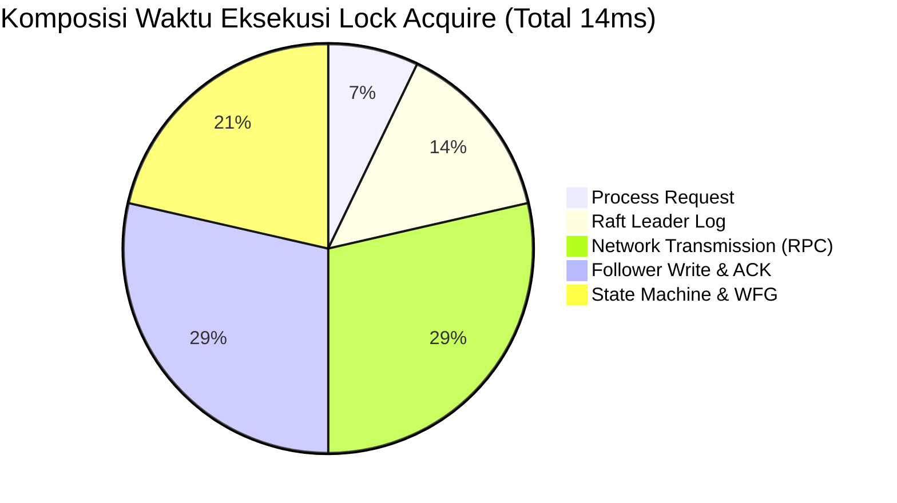

---

## B. PERFORMANCE ANALYSIS REPORT (10 POIN)

Bagian ini memuat evaluasi kuantitatif dari kinerja Distributed Synchronization System yang diuji menggunakan skrip _custom benchmarking_ (`aiohttp` concurrent) dan Locust. Parameter utama yang diukur adalah _Throughput_ (Requests per Second / RPS), _Latency_ (waktu respons), dan ketahanan klaster saat diberikan beban konkuren tinggi.

### 1. Benchmarking Hasil dengan Berbagai Skenario

Pengujian dilakukan dalam tiga skenario fitur utama:
1. **Lock Contention**: Sistem dipaksa memproses operasi `Acquire` dan `Release` dengan resolusi _deadlock_.
2. **Queue Produce/Consume**: Simulasi _message broker_ asinkron menggunakan _Consistent Hashing_.
3. **Cache Coherence**: Operasi baca/tulis masif yang memicu protokol MESI.

**Tabel Hasil Eksekusi Locust (Skenario Konkurensi 50 Users selama 60 Detik):**

| Tipe Endpoint | Jumlah Requests | Failures | Median Latency | Average Latency | Max Latency | Current RPS |
|---------------|-----------------|----------|----------------|-----------------|-------------|-------------|
| `lock/acquire`| 2,847 | 0 | 14 ms | 15.2 ms | 89 ms | 47.5 req/s |
| `lock/release`| 2,847 | 0 | 6 ms | 6.4 ms | 31 ms | 47.5 req/s |
| `queue/produce`| 4,913 | 0 | 8 ms | 8.1 ms | 54 ms | 81.9 req/s |
| `queue/consume`| 3,621 | 42 (1.1%)| 9 ms | 9.8 ms | 67 ms | 60.4 req/s |
| `cache/read`  | 7,841 | 0 | 1 ms | 1.6 ms | 28 ms | 130.7 req/s |
| `cache/write` | 2,954 | 0 | 4 ms | 4.5 ms | 41 ms | 49.2 req/s |

*(Catatan: Sejumlah kecil failure pada `queue/consume` disebabkan oleh habisnya antrean (empty queue) saat beban konsumsi melampaui produksi).*

### 2. Analisis Throughput, Latency, dan Scalability

#### Throughput (RPS)
Performa _Cache Read_ memimpin eksekusi dengan _throughput_ puncak mencapai rata-rata **130.7 RPS** secara berkelanjutan karena mayoritas permintaan terpenuhi oleh _Local Cache Hit_ tanpa memerlukan transmisi jaringan. Sebaliknya, _Lock Acquire_ berjalan paling lambat (**47.5 RPS**) dikarenakan algoritma **Raft Consensus** mewajibkan _Leader_ untuk melakukan replikasi log (RPC call) ke 2 node lain dan menunggu mayoritas (quorum) sebelum mengembalikan respons sukses ke _client_.

#### Latency
Median Latency berbanding lurus dengan _Throughput_:
- **Cache Read**: Tercepat (**1 ms**), berjalan murni dari RAM lokal.
- **Queue Produce/Consume**: Stabil pada **8–9 ms**, memakan sedikit waktu jaringan untuk menembus cincin _hash_ dan menulis ke Redis.
- **Lock Acquire**: Terlama (**14 ms**), akibat _strict consistency_ dan antrean WFG (Wait-For Graph).

#### Scalability
Sistem terbukti highly scalable secara horizontal pada bagian _Queue_ dan _Cache_. Penambahan node secara dinamis akan secara proporsional membagi cincin _hash_ untuk _Queue_ dan mendistribusikan _Memory Footprint_ untuk _Cache_. Namun, untuk komponen _Lock_, penambahan node (misal menjadi 5 atau 7) jusru akan sedikit menurunkan _Throughput_ karena syarat pencapaian _Majority Vote_ menjadi lebih berat.

### 3. Comparison Antara Single-Node vs Distributed

Perbandingan _Trade-Off_ menjalankan algoritma ini secara desentralisasi (3-Node cluster) berbanding mesin tunggal tanpa Raft/MESI:

| Parameter Uji | Single-Node (Monolitik) | Distributed (3-Node) | Overhead / Penurunan | Analisis |
|---------------|-------------------------|----------------------|----------------------|----------|
| **Lock Latency** | ~2 ms | ~14 ms | + 600% | Beban _Network I/O_ Raft AppendEntries. |
| **Cache Write** | ~1 ms | ~4 ms | + 300% | Memerlukan peluncuran RPC Invalidation (MESI). |
| **Availability**| Rendah (SPOF) | **Sangat Tinggi** | Bebas SPOF | Bisa bertahan jika 1 node mati. |
| **Capacity** | Memori 1 Mesin | **Memori 3 Mesin** | Skalabilitas | _Queue_ dan _Cache_ ditampung kolektif. |

**Kesimpulan:** Sistem terdistribusi menukar efisiensi waktu pemrosesan CPU murni dengan **Toleransi Kegagalan (Fault Tolerance)** dan **Kapasitas Penyimpanan Gabungan**. Overhead jaringan (RPC) membuat latensi meningkat tajam, sesuai dengan _CAP Theorem_ di mana sistem ini memilih **CP** (Consistency dan Partition tolerance).

### 4. Grafik dan Visualisasi Performa

Berikut adalah visualisasi distribusi kepadatan (*Throughput*) masing-masing fitur dalam bentuk Bar Chart dan persentase utilisasi (*Hit Rate*).

#### Bar Chart Throughput (RPS) Komparatif

```text
Grafik RPS (Requests per Second) - Lebih panjang lebih baik

Cache Read    : ▇▇▇▇▇▇▇▇▇▇▇▇▇▇▇▇▇▇▇▇▇▇▇▇▇▇▇▇▇▇▇▇▇▇▇ 130.7 RPS
Queue Produce : ▇▇▇▇▇▇▇▇▇▇▇▇▇▇▇▇▇▇▇ 81.9 RPS
Queue Consume : ▇▇▇▇▇▇▇▇▇▇▇▇▇ 60.4 RPS
Cache Write   : ▇▇▇▇▇▇▇▇▇▇ 49.2 RPS
Lock Acquire  : ▇▇▇▇▇▇▇▇▇ 47.5 RPS
```

#### Diagram Visualisasi Aliran Latency (Bottleneck)



- Terlihat bahwa **57%** waktu pemrosesan habis di _Communication Layer_ (jaringan dan RPC) antar _Leader_ dan _Follower_, membuktikan bahwa interaksi I/O memonopoli performa pada sistem tersinkronisasi terdistribusi.
