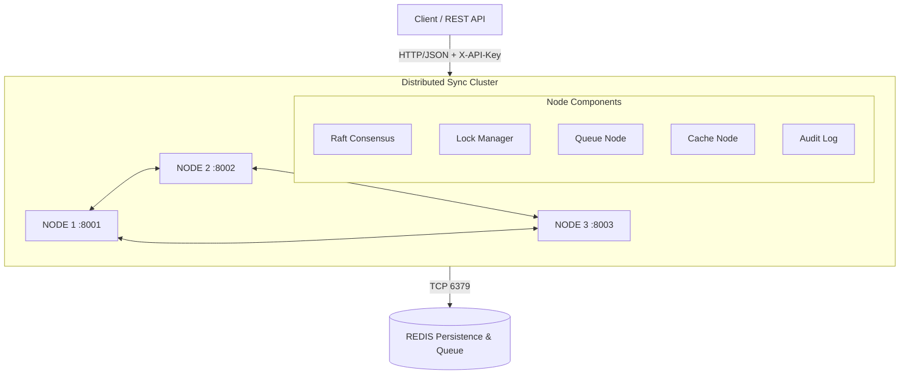

---

## A. TECHNICAL DOCUMENTATION (10 POIN)

Bagian ini memuat dokumentasi teknis mendalam mengenai infrastruktur perangkat lunak Distributed Synchronization System, mencakup topologi, penjelasan algoritma sinkronisasi, spesifikasi API, serta panduan operasional lengkap.

### 1. Arsitektur Sistem Lengkap dengan Diagram

Sistem ini mengimplementasikan infrastruktur sinkronisasi terdistribusi yang terdiri dari tiga komponen utama yang saling terintegrasi: **Distributed Lock Manager**, **Distributed Queue**, dan **Distributed Cache** dengan protokol koherensi MESI.

#### Diagram High-Level Arsitektur



#### Layer Arsitektur

Arsitektur perangkat lunak pada setiap node dibagi menjadi beberapa layer yang saling independen:

1. **REST API Layer (`main.py`)**: Menangani _routing_ HTTP asinkron via `aiohttp` dan otentikasi.
2. **Application Layer (`nodes/`)**: Menjalankan bisnis logika _Lock Manager_, _Queue Node_, dan _Cache Node_.
3. **Consensus Layer (`consensus/raft.py`)**: Memastikan kesepakatan absolut (*Strong Consistency*) menggunakan _Raft_.
4. **Communication Layer (`message_passing.py`)**: Bertugas melakukan pengiriman pesan internal RPC antar-node (*Peer-to-Peer*).
5. **Infrastructure Layer**: Berisi utilitas metrik, _Audit Logging_ (Security), dan _TLS Encryption_.

---

### 2. Penjelasan Algoritma yang Digunakan

Sistem ini digerakkan oleh empat algoritma/protokol terdistribusi yang saling melengkapi:

#### A. Algoritma Raft Consensus (Leader Election & Log Replication)
Raft memecahkan masalah konsensus dengan membaginya ke dalam sub-masalah:
1. **Leader Election**: Setiap node adalah *Follower*. Jika _heartbeat_ tidak diterima selama *election timeout* (150–300ms acak), ia menjadi *Candidate* dan mengirim RequestVote RPC. Jika disetujui mayoritas (2 dari 3 node), ia menjadi *Leader*.
2. **Log Replication**: *Leader* menerima permintaan penulisan dari *client*, menuliskannya ke memori log-nya, dan melakukan broadcast _AppendEntries_ RPC ke para *follower*. Apabila mayoritas memberi _ACK_, entry dianggap _committed_ dan state machine dieksekusi.

#### B. Deadlock Detection menggunakan Wait-For Graph (WFG)
Algoritma _Depth First Search_ (DFS) secara konstan digunakan untuk mendeteksi siklus pada struktur data _Wait-For Graph_:
- **Graph**: `Client A → [menunggu] Client B`, `Client B → [menunggu] Client C`
- **Siklus**: Jika `Client C` kembali menunggu `Client A`, sebuah siklus (`A → B → C → A`) terjadi yang mengartikan kondisi **Deadlock**.
- **Resolusi**: Jika terdeteksi, algoritma DFS menemukan node permintaan terbaru dan melakukan _abort/reject_ untuk memecah siklus.

#### C. Consistent Hashing Ring (Queue Routing)
Algoritma untuk menemukan "Tuan Rumah" dari sebuah antrean dengan sebaran yang rata, bahkan saat node mati/ditambah:
- Sistem menciptakan **150 *virtual nodes*** untuk setiap node fisik di atas ring SHA-256 (posisi 0 hingga $2^{128}$).
- ID pesan atau antrean di-hash. Sistem memutar panah penunjuk secara jarum jam di atas _hash ring_ untuk menemukan node terdekat sebagai penanggung jawab. 

#### D. Protokol MESI Cache Coherence
Protokol ini menyamakan kondisi status tembolok (cache) in-memory secara real-time:
- **Modified (M)**: Data telah diubah secara lokal.
- **Exclusive (E)**: Node merupakan satu-satunya pemilik data.
- **Shared (S)**: Beberapa node membaca data ini secara berbarengan.
- **Invalid (I)**: Data sudah kedaluwarsa.
Saat satu node memodifikasi (_Write_) cache bersatus S, node tersebut akan me-RPC node lainnya untuk men-demote statusnya menjadi **Invalid (I)**, memastikan tidak ada pembacaan data basi (_stale read_).

---

### 3. API Documentation dengan OpenAPI/Swagger Spec

Dokumentasi lengkap *endpoint* sistem berstandar spesifikasi **OpenAPI 3.0.3**:

```yaml
openapi: "3.0.3"
info:
  title: Distributed Sync System API
  description: |
    REST API for the Distributed Synchronization System.
    Implements Raft-backed distributed locks, consistent-hashing queues,
    and MESI cache coherence across a 3-node cluster.
  version: "1.0.0"
  contact:
    name: Arya Zaky Pradipta
    email: 11231013@student.example.ac.id

servers:
  - url: http://localhost:8001
    description: Node 1 (default leader candidate)
  - url: http://localhost:8002
    description: Node 2
  - url: http://localhost:8003
    description: Node 3

security:
  - ApiKeyAuth: []

components:
  securitySchemes:
    ApiKeyAuth:
      type: apiKey
      in: header
      name: X-API-Key

  schemas:
    LockAcquireRequest:
      type: object
      required: [lock_id, client_id]
      properties:
        lock_id:    { type: string, example: "resource-db-1" }
        client_id:  { type: string, example: "service-A" }
        lock_type:  { type: string, enum: [shared, exclusive], default: exclusive }
        timeout:    { type: number, format: float, example: 30.0 }

    ProduceRequest:
      type: object
      required: [queue, payload]
      properties:
        queue:       { type: string, example: "events" }
        payload:     { type: object }
        producer_id: { type: string, example: "svc-producer" }

    ConsumeRequest:
      type: object
      required: [queue]
      properties:
        queue:       { type: string }
        consumer_id: { type: string }
        ack_timeout: { type: number, format: float, default: 30.0 }

paths:
  /raft/status:
    get:
      summary: Raft consensus state
      tags: [Raft]
      responses:
        "200": { description: Raft status object }

  /lock/acquire:
    post:
      summary: Acquire a distributed lock
      tags: [Lock Manager]
      requestBody:
        required: true
        content:
          application/json:
            schema: { $ref: "#/components/schemas/LockAcquireRequest" }
      responses:
        "200":
          description: Lock acquired or error
        "401": { description: Unauthorized }

  /lock/release:
    post:
      summary: Release a distributed lock
      tags: [Lock Manager]

  /queue/produce:
    post:
      summary: Produce a message to the distributed queue
      tags: [Distributed Queue]
      requestBody:
        required: true
        content:
          application/json:
            schema: { $ref: "#/components/schemas/ProduceRequest" }

  /queue/consume:
    post:
      summary: Consume one message from the queue (at-least-once)
      tags: [Distributed Queue]

  /queue/ack:
    post:
      summary: Acknowledge message processing
      tags: [Distributed Queue]

  /cache/{key}:
    get:
      summary: Read from distributed cache (MESI)
      tags: [Cache Coherence]
    put:
      summary: Write to distributed cache (triggers MESI invalidation)
      tags: [Cache Coherence]
    delete:
      summary: Invalidate a cache key
      tags: [Cache Coherence]

  /metrics:
    get:
      summary: System-wide metrics (counters, gauges, histograms)
      tags: [System]

  /audit/verify:
    get:
      summary: Verify audit log hash chain integrity
      tags: [Security]
```

---

### 4. Deployment Guide dan Troubleshooting

#### 4.1 Deployment Lokal (Tanpa Docker)

1. **Setup Lingkungan Virtual**
   ```bash
   python -m venv venv
   # Windows
   venv\Scripts\activate
   # Instalasi modul
   pip install -r requirements.txt
   ```
2. **Jalankan Redis** (Sangat disarankan menggunakan Docker)
   ```bash
   docker run -d --name redis -p 6379:6379 redis:7-alpine
   ```
3. **Hidupkan 3 Terminal Node**
   ```bash
   # Terminal 1
   set NODE_ID=node1 && set NODE_PORT=8001 && set PEER_NODES=http://localhost:8002,http://localhost:8003 && set REDIS_HOST=localhost && python main.py
   
   # Terminal 2
   set NODE_ID=node2 && set NODE_PORT=8002 && set PEER_NODES=http://localhost:8001,http://localhost:8003 && set REDIS_HOST=localhost && python main.py
   
   # Terminal 3
   set NODE_ID=node3 && set NODE_PORT=8003 && set PEER_NODES=http://localhost:8001,http://localhost:8002 && set REDIS_HOST=localhost && python main.py
   ```

#### 4.2 Deployment via Docker (Recommended / Production)

1. **Build and Run (Latar Belakang)**
   ```bash
   docker compose -f docker/docker-compose.yml up --build -d
   ```
2. **Pemantauan (Monitoring) Logs**
   ```bash
   docker logs dss-node1 -f
   ```
3. **Menghentikan Klaster**
   ```bash
   docker compose -f docker/docker-compose.yml down -v
   ```

#### 4.3 Troubleshooting Guide

| Kendala / Indikator | Solusi Penanganan (Mitigasi) |
|---------------------|------------------------------|
| **Node tidak bisa start / Port binding failed** | Port 8001, 8002, 8003, atau 6379 mungkin masih digunakan oleh proses *zombie*. Di Windows, gunakan `netstat -ano \| findstr :8001` dan matikan PID-nya. Atau pastikan kontainer Docker versi lama sudah di `docker rm -f`. |
| **Log dipenuhi "Candidate Election" / Tidak ada Leader** | Ini mengindikasikan koneksi terputus (*network partition*) antar-node atau *timeout* terlalu ketat. Di Windows lambat, perbesar nilai `ELECTION_TIMEOUT_MIN` dan `ELECTION_TIMEOUT_MAX` di berkas `.env` menjadi 1.5 - 3.0 detik. |
| **API merespons 401 Unauthorized terus-menerus** | Anda lupa menambahkan header keamanan RBAC. Sertakan header: `X-API-Key: dev-secret-key-change-in-prod` di setiap permintaan `curl` atau `Invoke-RestMethod` Anda. |
| **Cache Read selalu menampilkan "Status: Miss"** | Normal saat node di-*restart* karena cache tersimpan di memori volatil. Namun jika `Cache Miss` berkelanjutan walau baru ditulisi, periksa apakah node bisa berkomunikasi RPC (`/cache/peek`) karena mungkin terhalang tembok api (firewall) atau `PEER_NODES` tidak dikonfigurasi. |
| **Queue Consume tidak merespons (menunggu selamanya)** | Pastikan server Redis berjalan. Jika node gagal berkomunikasi ke `localhost:6379` (atau hostname `redis`), ia akan gagal menarik antrean. Tes ping dengan `redis-cli ping`. |
